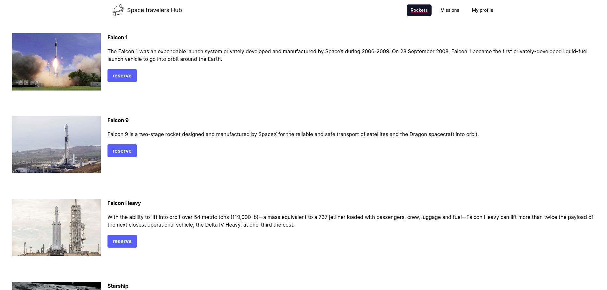
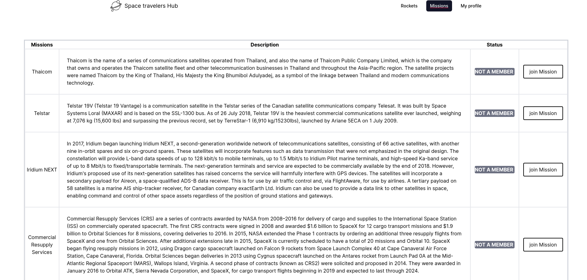

# Space-travelers-hub

> A web app where you can reserved Rockets that you like and see Missions about space travelers and you can join mission that you love it will be stored in your Profile page

## Built With

- HTML
- CSS
- JAVASCRIPT
- WEBPACK
- Jest
- React Testing
- React
- Redux
- Redux-thunk
- Tailwind css
- Axios

## Live demo

[Live demo](https://space-travelers-hub-project.herokuapp.com/)

## Getting Started
## To run the website locally follow the following steps:

### Clone the project to your local machine
    git clone git@github.com:Mithi-code/Space-travelers-hub.git
### Move to the root directory 
    cd Space-travelers-hub
### Install dependencies
    npm install
### Open the website in the browser
    npm start
    

👤 **Youmari**

- GitHub: [@youmari](https://github.com/youmari)
- Twitter: [@yf_omari](https://twitter.com/yf_omari)
- LinkedIn: [LinkedIn](https://www.linkedin.com/in/yassine-omari-945114190/)

👤 **Mithi**

- GitHub: [@githubhandle](https://github.com/Mithi-code)
- Twitter: [@twitterhandle](https://twitter.com/LazyMithlesh)
- LinkedIn: [LinkedIn](https://www.linkedin.com/in/mithlesh-kumar-564a97221/)

## 🤝 Contributing

Contributions, issues, and feature requests are welcome!

Feel free to check the [issues page](../../issues/).

## Show your support

Give a ⭐️ if you like this project!